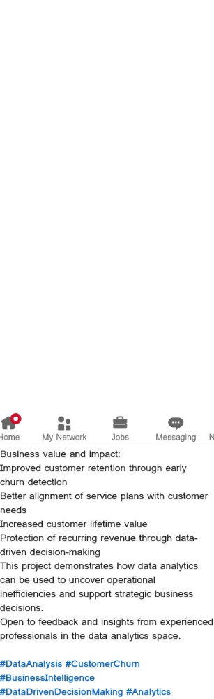

# Customer Churn Analysis Dashboard

## Project Overview
This project focuses on identifying the root causes of customer churn using data-driven insights. By analyzing customer usage patterns, service plans, and geographic distribution, the dashboard highlights operational gaps and provides actionable recommendations to improve retention.

## Key Features
- **Churn Rate Analysis**: Visualizing churn trends across different customer segments.
- - **Root Cause Identification**: Pinpointing specific factors contributing to customer attrition.
  - - **Predictive Insights**: Using historical data to identify at-risk customers.
    - - **Operational Recommendations**: Strategic suggestions for service plan alignment and customer engagement.
     
      - ## Tools Used
      - - **Power BI**: For data visualization and dashboard creation.
        - - **DAX**: For complex calculations and metric development.
          - - **Data Cleaning**: Ensuring data accuracy and consistency for reliable analysis.
           
            - ## Dashboard Preview
            - 
           
            - ## Business Impact
            - - **Improved Retention**: Early detection of churn patterns allows for proactive customer engagement.
              - - **Strategic Alignment**: Better alignment of service plans with customer needs.
                - - **Revenue Protection**: Identifying and mitigating risks to recurring revenue.
                 
                  - 
